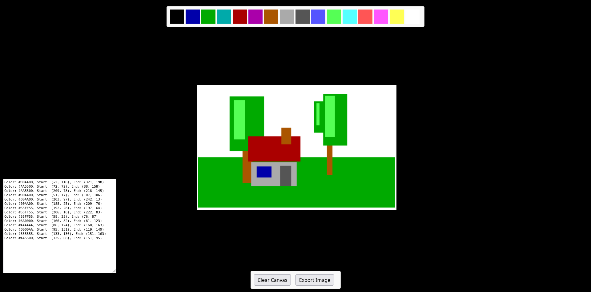

# bytePainter User Manual

## Overview

bytePainter is a simple yet powerful drawing tool designed to create and manage rectangle-based artworks with a few clicks. Users can choose colors from the VGA default palette, draw rectangles on a canvas, and export their creations in PNG format. The program also features a live output panel that provides the definition of each drawn rectangle, including color index and dimensions.
Features

- Color Selection: Choose from the standard VGA color palette to draw rectangles.
- Interactive Drawing Canvas: Click and drag to define the size and position of your rectangles.
- -Export Functionality: Export your drawing as a PNG file.
- Output Panel: Track the details of each drawn rectangle including color index and dimensions.
- Clear Canvas: Easily clear the canvas to start a new drawing.

## Getting Started
Launching the Program

Open the provided HTML file in any modern web browser to start using bytePainter.
Interface Description

### The interface is divided into several key areas:

- Color Palette: Located at the top of the screen, where you can select the color for your rectangles.
- Drawing Area: Below the palette, where rectangles are drawn.
- Toolbox: Contains buttons for exporting the image and clearing the canvas.
- Output Panel: Displays details of drawn rectangles, including color and dimensions.

## Using bytePainter

### Drawing a Rectangle

#### Select a Color:
Click on a color in the color palette at the top of the screen. This color will be used for drawing your rectangle.

#### Draw a Rectangle:
- Click on the canvas where you want the top-left corner of your rectangle to be.
- Hold down the mouse button and drag to the desired bottom-right corner.
- Release the mouse button to finalize the rectangle.

### Exporting Your Drawing

Click the Export Image button in the toolbox. The image will be saved as a PNG file to your default download location.

### Clearing the Canvas

To remove all rectangles and start anew, click the Clear Canvas button in the toolbox.

### Understanding the Output Panel

The output panel at the bottom left of the screen updates with each rectangle's details as you draw:
- Color Index: The index number of the color used from the palette.
- Position and Size: The starting coordinates and dimensions of the rectangle.

### Tips

- Ensure your browser window is maximized for the best drawing experience.
- Use the output panel details if you need to recreate specific rectangles in other applications or projects.

## Troubleshooting

- Rectangles not appearing: Make sure you've selected a color before trying to draw.
- Export doesn’t work: Check your browser’s permission settings to allow downloads.
- Interface elements overlap: This can occur in smaller browser windows or lower screen resolutions. Maximizing the window or increasing the resolution should resolve this issue.