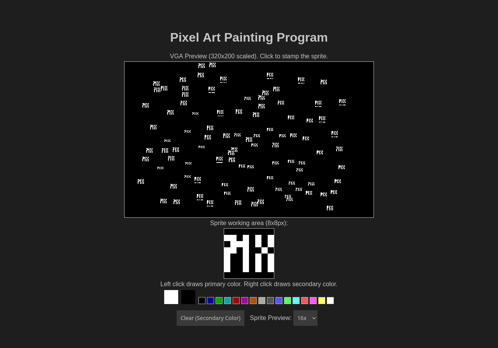

# Pixelator - Pixel Art Painting Program Manual

## Introduction

Welcome to the Pixelator - Pixel Art Painting Program! This program allows you to create 8x8 pixel art sprites with ease. You can draw on a canvas, preview your sprite, and save the final image. This manual will guide you through the features and how to use the program.
Features

- Drawing Canvas: An 8x8 pixel grid where you can draw your sprite.
- Preview Canvas: A scaled preview of your sprite.
- Color Palette: A selection of VGA colors to choose from for drawing.
- Primary and Secondary Colors: Quickly select primary (left-click) and secondary (right-click) colors.
- Clear & Fill Background: Clear the canvas and fill the preview background with the secondary color.
- Resizable Pixels: Change the pixel size on the drawing canvas (8x, 16x, 32x).

## Getting Started

### Interface Overview

- Drawing Canvas: The main canvas where you draw your sprite. It supports 8x8 pixels but each pixel can be scaled up to make drawing easier.
- Preview Canvas: A larger canvas that shows your sprite in real-time.
- Color Palette: Located below the canvases, featuring VGA colors for selection.
- Controls: Buttons and dropdowns to clear the canvas, change pixel size, and manage colors.

### Drawing on the Canvas

#### Select a Color:
- Primary Color: Left-click on a color in the palette to set it as the primary color.
- Secondary Color: Right-click on a color in the palette to set it as the secondary color.
#### Draw on the Canvas:
- Left-click on the drawing canvas to draw with the primary color.
- Right-click on the drawing canvas to draw with the secondary color.

### Previewing Your Sprite

The preview canvas displays a scaled version of your sprite. Any changes made on the drawing canvas will be reflected here in real-time.

#### Clearing the Canvas

Clear & Fill Background: Click the "Clear & Fill Background" button to clear the drawing canvas and fill the preview canvas with the secondary color.

### Changing Pixel Size

Pixel Size Dropdown: Use the dropdown menu labeled "Canvas Size" to change the size of the pixels on the drawing canvas. Options are: 8x, 16x, 32x

### Keyboard Shortcuts

Clear & Fill Background: Use the "Clear & Fill Background" button to reset the canvas and fill the preview with the secondary color.

### Tips

- Saving Your Art: Right-click on the preview canvas and select "Save image as..." to save your sprite.
- Experiment with Colors: Use the color palette to experiment with different color combinations.
- Use Secondary Color for Background: Set your secondary color to your desired background color and use the clear button to fill the preview canvas.

## Troubleshooting

Context Menu on Right-Click: The program disables the context menu on right-click within the palette and drawing canvas to ensure smooth color selection and drawing.

## Conclusion

Enjoy creating your pixel art sprites with the Pixel Art Painting Program! If you have any questions or need further assistance, please refer to this manual or seek help from the support team.